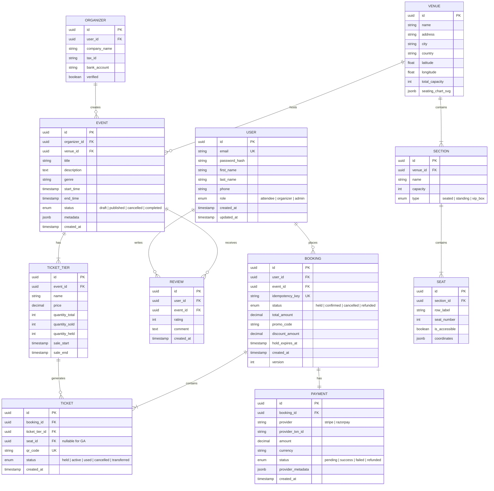
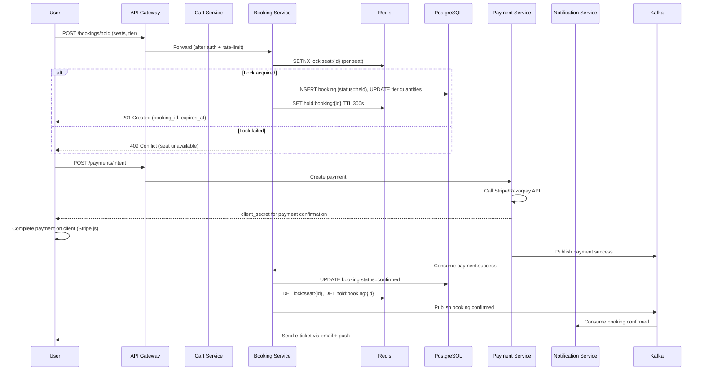
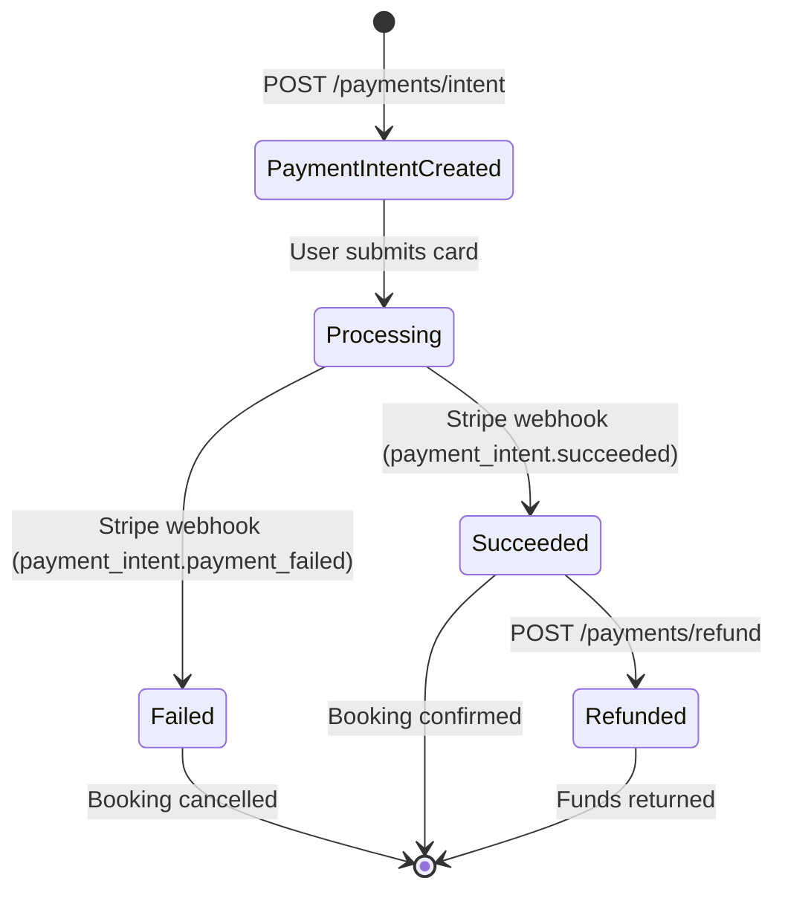
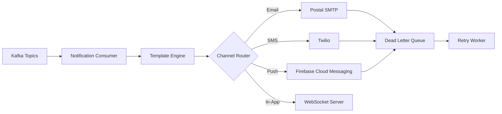
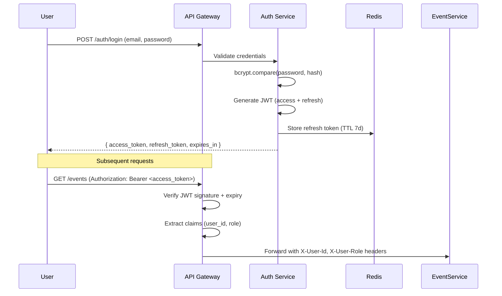
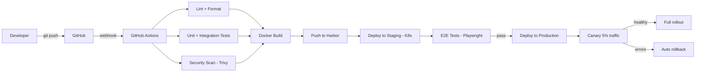
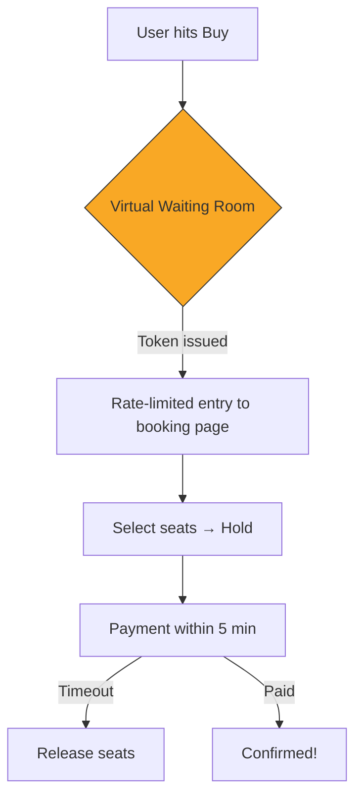

# 🎫 Event Ticket Booking Platform — System Design Document

> **Version**: 1.0  
> **Author**: Gopal Saini  
> **Date**: February 21, 2026  
> **Status**: Draft

---

## Table of Contents

1. [Executive Summary](#1-executive-summary)
2. [Functional Requirements](#2-functional-requirements)
3. [Non-Functional Requirements](#3-non-functional-requirements)
4. [High-Level Architecture](#4-high-level-architecture)
5. [System Components](#5-system-components)
6. [Data Model](#6-data-model)
7. [API Design](#7-api-design)
8. [Booking & Reservation Flow](#8-booking--reservation-flow)
9. [Seat Selection & Inventory Management](#9-seat-selection--inventory-management)
10. [Payment Processing](#10-payment-processing)
11. [Search & Discovery](#11-search--discovery)
12. [Notification System](#12-notification-system)
13. [Authentication & Authorization](#13-authentication--authorization)
14. [Caching Strategy](#14-caching-strategy)
15. [Infrastructure & Deployment](#15-infrastructure--deployment)
16. [Observability & Monitoring](#16-observability--monitoring)
17. [Security Considerations](#17-security-considerations)
18. [Scalability & Performance](#18-scalability--performance)
19. [Failure Handling & Resilience](#19-failure-handling--resilience)
20. [Future Enhancements](#20-future-enhancements)

---

## 1. Executive Summary

The **Event Ticket Booking Platform** is a distributed, cloud-native system designed to handle the full lifecycle of live-event ticketing — from event creation and discovery through seat selection, payment, and digital ticket delivery. The system is built to withstand high-concurrency flash-sale scenarios (e.g., 100K+ concurrent users competing for limited inventory) while maintaining data consistency and a responsive user experience.

### Key Business Goals

| Goal                 | Metric                                            |
| -------------------- | ------------------------------------------------- |
| High availability    | 99.95% uptime SLA                                 |
| Low latency          | < 200 ms P95 for search, < 500 ms P95 for booking |
| Flash-sale readiness | Sustain 50K+ concurrent booking attempts          |
| Fraud prevention     | < 0.1% fraudulent transactions                    |
| Global reach         | Multi-region deployment with reverse proxy CDN    |

---

## 2. Functional Requirements

### 2.1 User Personas

| Persona              | Description                                                               |
| -------------------- | ------------------------------------------------------------------------- |
| **Attendee**         | Browses events, selects seats, books tickets, receives e-tickets          |
| **Event Organizer**  | Creates events, manages venues, configures pricing tiers, views analytics |
| **Platform Admin**   | Manages users, reviews flagged content, handles disputes                  |
| **Box Office Agent** | Processes in-person sales, handles will-call                              |

### 2.2 Core Features

#### Attendee

- Register / Login (email, social, SSO)
- Browse and search events (by genre, date, location, artist)
- View interactive venue maps with real-time seat availability
- Add tickets to cart → temporary hold → checkout
- Apply promo codes and group discounts
- Pay via credit card, digital wallet, UPI, net banking
- Receive e-ticket (QR code) via email and in-app
- View booking history, download invoices
- Cancel / transfer tickets (per event refund policy)
- Waitlist registration for sold-out events

#### Event Organizer

- CRUD operations for events (details, media, schedule)
- Venue and seating chart management
- Pricing tier configuration (VIP, General, Early Bird, etc.)
- Bulk ticket allocation and hold management
- Real-time sales dashboard and revenue analytics
- Manage promo codes and discount rules
- Settlement and payout reports

#### Platform Admin

- User management and role assignment
- Content moderation (flagged events/reviews)
- Dispute and refund arbitration
- System configuration and feature flags

---

## 3. Non-Functional Requirements

| Category          | Requirement                                                               |
| ----------------- | ------------------------------------------------------------------------- |
| **Scalability**   | Horizontal auto-scaling; handle 10x traffic spikes during on-sales        |
| **Availability**  | 99.95% uptime; multi-node deployment with automated failover              |
| **Latency**       | P95 < 200 ms for reads, P95 < 500 ms for writes                           |
| **Consistency**   | Strong consistency for seat inventory; eventual consistency for analytics |
| **Durability**    | Zero ticket data loss; RPO < 1 min                                        |
| **Security**      | PCI-DSS Level 1 for payment; OWASP Top 10 mitigation                      |
| **Compliance**    | GDPR, CCPA for PII handling                                               |
| **Observability** | Distributed tracing, structured logging, real-time alerting               |

---

## 4. High-Level Architecture

The system follows a **microservices architecture** with an API Gateway front-door pattern, event-driven communication via a message broker, and a polyglot persistence layer.

```
┌─────────────────────────────────────────────────────────────────────────────────┐
│                              CLIENT LAYER                                       │
│  ┌──────────┐  ┌──────────┐  ┌──────────┐  ┌──────────────┐                    │
│  │ Web App  │  │ iOS App  │  │ Android  │  │ Box Office   │                    │
│  │ (React)  │  │ (Swift)  │  │ (Kotlin) │  │ Terminal     │                    │
│  └────┬─────┘  └────┬─────┘  └────┬─────┘  └──────┬───────┘                    │
│       │              │             │               │                            │
│       └──────────────┴─────────────┴───────────────┘                            │
│                              │                                                  │
└──────────────────────────────┼──────────────────────────────────────────────────┘
                               │
                        ┌──────┴──────┐
                        │    CDN /    │
                        │  Nginx      │
                        └──────┬──────┘
                               │
┌──────────────────────────────┼──────────────────────────────────────────────────┐
│                       GATEWAY LAYER                                             │
│                 ┌────────────┴────────────┐                                     │
│                 │      API Gateway        │                                     │
│                 │  (Kong / Traefik)       │                                     │
│                 │  • Rate Limiting        │                                     │
│                 │  • Auth (JWT)           │                                     │
│                 │  • Request Routing      │                                     │
│                 │  • SSL Termination      │                                     │
│                 └──────┬────┬────┬────┬───┘                                     │
│                        │    │    │    │                                          │
└────────────────────────┼────┼────┼────┼──────────────────────────────────────────┘
                         │    │    │    │
┌────────────────────────┼────┼────┼────┼──────────────────────────────────────────┐
│                  SERVICE LAYER (Kubernetes)                                      │
│                        │    │    │    │                                          │
│  ┌─────────────┐  ┌────┴──┐│┌───┴──┐ │ ┌────────────┐  ┌──────────────┐        │
│  │ User        │  │Event  │││Booking│ │ │ Payment    │  │ Notification │        │
│  │ Service     │  │Service│││Service│ │ │ Service    │  │ Service      │        │
│  └──────┬──────┘  └───┬───┘│└───┬──┘ │ └─────┬──────┘  └──────┬───────┘        │
│         │              │    │    │    │        │                │                │
│  ┌──────┴──────┐  ┌───┴──┐ │ ┌──┴───┐│ ┌─────┴──────┐  ┌─────┴───────┐        │
│  │ Search      │  │Venue │ │ │Cart  ││ │ Analytics  │  │ Waitlist    │        │
│  │ Service     │  │Svc   │ │ │Svc   ││ │ Service    │  │ Service     │        │
│  └─────────────┘  └──────┘ │ └──────┘│ └────────────┘  └─────────────┘        │
│                             │         │                                         │
└─────────────────────────────┼─────────┼─────────────────────────────────────────┘
                              │         │
┌─────────────────────────────┼─────────┼─────────────────────────────────────────┐
│                   MESSAGING LAYER                                               │
│              ┌──────────────┴─────────┴──────────────┐                          │
│              │           Apache Kafka (KRaft)        │                          │
│              │  Topics: booking.*, payment.*, event.* │                          │
│              └───────────────────────────────────────┘                          │
└─────────────────────────────────────────────────────────────────────────────────┘
                              │
┌─────────────────────────────┼───────────────────────────────────────────────────┐
│                    DATA LAYER                                                   │
│  ┌───────────┐  ┌───────────┐  ┌─────────────┐  ┌───────────┐  ┌────────────┐  │
│  │PostgreSQL │  │ Redis     │  │Elasticsearch│  │ MinIO     │  │ ClickHouse │  │
│  │(Primary   │  │ (Cache &  │  │(Search &    │  │ (Media &  │  │ (Analytics)│  │
│  │ OLTP)     │  │  Locks)   │  │ Discovery)  │  │  Tickets) │  │            │  │
│  └───────────┘  └───────────┘  └─────────────┘  └───────────┘  └────────────┘  │
│                                                                                 │
└─────────────────────────────────────────────────────────────────────────────────┘
```

### Architecture Principles

| Principle                | Implementation                                                                         |
| ------------------------ | -------------------------------------------------------------------------------------- |
| **Domain-Driven Design** | Each service owns its bounded context and data store                                   |
| **Event Sourcing**       | Booking state transitions emitted as immutable events                                  |
| **CQRS**                 | Separate read/write models for inventory (write-optimized) and search (read-optimized) |
| **12-Factor App**        | Config via env vars, stateless services, disposable containers                         |
| **API-First**            | OpenAPI 3.1 specs authored before implementation                                       |

---

## 5. System Components

### 5.1 User Service

| Attribute          | Detail                                                                                  |
| ------------------ | --------------------------------------------------------------------------------------- |
| **Responsibility** | Registration, authentication, profile management, role management                       |
| **Tech Stack**     | Node.js / Express, PostgreSQL, Redis (session cache)                                    |
| **Auth**           | JWT access tokens (15 min TTL) + refresh tokens (7 day TTL), OAuth 2.0 for social login |
| **Key Endpoints**  | `POST /auth/register`, `POST /auth/login`, `GET /users/me`, `PATCH /users/me`           |

### 5.2 Event Service

| Attribute          | Detail                                                                                     |
| ------------------ | ------------------------------------------------------------------------------------------ |
| **Responsibility** | Event CRUD, venue management, seating chart configuration, pricing tiers                   |
| **Tech Stack**     | Python / FastAPI, PostgreSQL, MinIO (media assets)                                         |
| **Key Endpoints**  | `POST /events`, `GET /events/{id}`, `PUT /events/{id}`, `POST /events/{id}/publish`        |
| **Caching**        | Event details cached in Redis (TTL 5 min); cache-aside pattern with invalidation on update |

### 5.3 Booking Service (Critical Path)

| Attribute               | Detail                                                                    |
| ----------------------- | ------------------------------------------------------------------------- |
| **Responsibility**      | Seat reservation, ticket hold, booking confirmation, cancellation         |
| **Tech Stack**          | Go (chosen for performance), PostgreSQL, Redis (distributed locks)        |
| **Concurrency Control** | Optimistic locking with version counter + Redis distributed lock per seat |
| **Idempotency**         | Client-generated idempotency key stored in Redis (TTL 24h)                |
| **Key Endpoints**       | `POST /bookings/hold`, `POST /bookings/confirm`, `DELETE /bookings/{id}`  |

### 5.4 Payment Service

| Attribute          | Detail                                                                     |
| ------------------ | -------------------------------------------------------------------------- |
| **Responsibility** | Payment intent creation, charge execution, refund processing               |
| **Tech Stack**     | Java / Spring Boot, PostgreSQL, Stripe / Razorpay SDK                      |
| **PCI Compliance** | Tokenized card data; no raw card numbers stored; PCI-DSS Level 1           |
| **Key Endpoints**  | `POST /payments/intent`, `POST /payments/confirm`, `POST /payments/refund` |

### 5.5 Search Service

| Attribute          | Detail                                                                     |
| ------------------ | -------------------------------------------------------------------------- |
| **Responsibility** | Full-text search, faceted filtering, geo-search, autocomplete              |
| **Tech Stack**     | Elasticsearch (7.x), synced via Kafka consumer from Event Service          |
| **Features**       | Fuzzy matching, synonym expansion, popularity boosting, geo-radius queries |
| **Key Endpoints**  | `GET /search/events?q=&genre=&city=&date_from=&date_to=`                   |

### 5.6 Notification Service

| Attribute           | Detail                                                                       |
| ------------------- | ---------------------------------------------------------------------------- |
| **Responsibility**  | Email, SMS, push notification delivery                                       |
| **Tech Stack**      | Node.js, Postal/Mailhog (email), Twilio (SMS), FCM/APNs (push)               |
| **Trigger**         | Event-driven via Kafka topics (`booking.confirmed`, `payment.success`, etc.) |
| **Template Engine** | Handlebars templates stored in MinIO                                         |

### 5.7 Analytics Service

| Attribute          | Detail                                                |
| ------------------ | ----------------------------------------------------- |
| **Responsibility** | Real-time dashboards, sales reporting, trend analysis |
| **Tech Stack**     | Python, ClickHouse for OLAP, Apache Superset for BI   |
| **Data Pipeline**  | Kafka → Flink/Spark Streaming → ClickHouse            |

### 5.8 Cart Service

| Attribute          | Detail                                                                  |
| ------------------ | ----------------------------------------------------------------------- |
| **Responsibility** | Multi-item cart, promo code validation, price calculation               |
| **Tech Stack**     | Node.js, Redis (ephemeral cart storage, TTL 15 min)                     |
| **Key Endpoints**  | `POST /cart/items`, `DELETE /cart/items/{id}`, `POST /cart/apply-promo` |

### 5.9 Waitlist Service

| Attribute          | Detail                                                                  |
| ------------------ | ----------------------------------------------------------------------- |
| **Responsibility** | Waitlist enrollment, position tracking, automatic offer on cancellation |
| **Tech Stack**     | Python / FastAPI, Redis Sorted Sets for queue                           |
| **Trigger**        | Listens to `booking.cancelled` events; offers next-in-line user         |

---

## 6. Data Model

### 6.1 Entity Relationship Diagram



### 6.2 Key Indexing Strategy

| Table         | Index                                  | Type        | Purpose                             |
| ------------- | -------------------------------------- | ----------- | ----------------------------------- |
| `event`       | `(status, start_time)`                 | B-Tree      | Active event listing sorted by date |
| `event`       | `(genre, city)`                        | B-Tree      | Filtered browsing                   |
| `ticket_tier` | `(event_id, sale_start, sale_end)`     | B-Tree      | Available tiers lookup              |
| `booking`     | `(user_id, created_at DESC)`           | B-Tree      | User booking history                |
| `booking`     | `(idempotency_key)`                    | Unique      | Duplicate prevention                |
| `ticket`      | `(qr_code)`                            | Unique Hash | O(1) scan at venue gate             |
| `seat`        | `(section_id, row_label, seat_number)` | Unique      | Seat uniqueness                     |
| `payment`     | `(provider_txn_id)`                    | Unique      | Reconciliation                      |

---

## 7. API Design

### 7.1 API Style & Conventions

- **REST** for synchronous CRUD operations
- **WebSocket** for real-time seat availability updates during booking
- **GraphQL** (optional) for the organizer dashboard to reduce over-fetching
- Versioned via URL prefix: `/api/v1/...`
- Pagination: cursor-based (`?cursor=abc&limit=20`)
- Error format: [RFC 7807 Problem Details](https://datatracker.ietf.org/doc/html/rfc7807)

### 7.2 Core API Endpoints

#### Events

```
GET    /api/v1/events                          # List/search events
GET    /api/v1/events/{eventId}                # Event details
POST   /api/v1/events                          # Create event (organizer)
PUT    /api/v1/events/{eventId}                # Update event (organizer)
POST   /api/v1/events/{eventId}/publish        # Publish event (organizer)
DELETE /api/v1/events/{eventId}                # Cancel event (organizer/admin)
GET    /api/v1/events/{eventId}/availability   # Real-time seat map
```

#### Bookings

```
POST   /api/v1/bookings/hold                   # Temporarily hold seats (5 min TTL)
POST   /api/v1/bookings/confirm                # Confirm booking after payment
GET    /api/v1/bookings/{bookingId}            # Booking details
DELETE /api/v1/bookings/{bookingId}            # Cancel booking
POST   /api/v1/bookings/{bookingId}/transfer   # Transfer to another user
GET    /api/v1/users/me/bookings               # User booking history
```

#### Payments

```
POST   /api/v1/payments/intent                 # Create payment intent
POST   /api/v1/payments/confirm                # Confirm payment (webhook-triggered)
POST   /api/v1/payments/{paymentId}/refund     # Initiate refund
GET    /api/v1/payments/{paymentId}            # Payment status
```

#### Search

```
GET    /api/v1/search/events?q=coldplay&city=mumbai&genre=music&date_from=2026-03-01
GET    /api/v1/search/suggest?q=cold           # Autocomplete
```

### 7.3 Sample Request / Response

**Hold Seats**

```http
POST /api/v1/bookings/hold
Content-Type: application/json
Authorization: Bearer <jwt>
Idempotency-Key: 550e8400-e29b-41d4-a716-446655440000

{
  "event_id": "evt_abc123",
  "ticket_tier_id": "tier_vip",
  "seat_ids": ["seat_A1", "seat_A2"],
  "promo_code": "EARLY20"
}
```

```http
HTTP/1.1 201 Created
{
  "booking_id": "bk_xyz789",
  "status": "held",
  "hold_expires_at": "2026-02-21T23:00:00Z",
  "line_items": [
    { "seat": "A1", "tier": "VIP", "price": 150.00 },
    { "seat": "A2", "tier": "VIP", "price": 150.00 }
  ],
  "subtotal": 300.00,
  "discount": 60.00,
  "total": 240.00,
  "currency": "USD"
}
```

---

## 8. Booking & Reservation Flow

### 8.1 Sequence Diagram



### 8.2 Hold Expiration

A background scheduler (cron job or Redis keyspace notification) triggers cleanup:

1. **Redis TTL expires** on `hold:booking:{id}` → keyspace event fires
2. **Booking Service** consumer receives the event
3. Booking status updated to `expired` in PostgreSQL
4. Seat locks released in Redis
5. `ticket_tier.quantity_held` decremented
6. Waitlist Service notified via `booking.expired` Kafka topic

### 8.3 Idempotency

Every booking request requires an `Idempotency-Key` header (client-generated UUID):

```
Idempotency-Key: 550e8400-e29b-41d4-a716-446655440000
```

- The key is stored in Redis with the response for 24 hours.
- Retries with the same key return the cached response without re-processing.
- This prevents double-booking during network retries.

---

## 9. Seat Selection & Inventory Management

### 9.1 Real-Time Seat Map

```
┌──────────────────────────── STAGE ────────────────────────────┐
│                                                                │
├──── VIP Section ─────────────────────────────────────────────┤
│  [A1✓] [A2✓] [A3✗] [A4✓] [A5✗] [A6✓] [A7✓] [A8✗]          │
│  [B1✓] [B2✗] [B3✓] [B4✓] [B5✓] [B6✗] [B7✓] [B8✓]          │
├──── Premium Section ─────────────────────────────────────────┤
│  [C1✓] [C2✓] ... (200 seats)                                 │
├──── General Admission ───────────────────────────────────────┤
│                    Standing Area (2000 capacity)               │
└───────────────────────────────────────────────────────────────┘

✓ = Available    ✗ = Sold/Held
```

### 9.2 Concurrency Control Strategy

The system uses a **two-layer locking** approach to handle flash-sale concurrency:

#### Layer 1: Redis Distributed Lock (Fast Path)

```
SETNX  lock:seat:evt_abc:A1  user_xyz  EX 300
```

- **Atomic**: SETNX ensures only one user acquires the lock
- **TTL**: 300 seconds matches the hold window
- **Granularity**: Per-seat lock minimizes contention

#### Layer 2: PostgreSQL Optimistic Locking (Durable Path)

```sql
UPDATE ticket_tier
SET    quantity_held = quantity_held + 1,
       version = version + 1
WHERE  id = 'tier_vip'
AND    quantity_sold + quantity_held < quantity_total
AND    version = 42;
-- If affected rows = 0 → sold out or version conflict → retry or fail
```

### 9.3 Inventory Counters

| Counter           | Location   | Purpose                                       |
| ----------------- | ---------- | --------------------------------------------- |
| `quantity_total`  | PostgreSQL | Source of truth (set by organizer)            |
| `quantity_sold`   | PostgreSQL | Confirmed bookings                            |
| `quantity_held`   | PostgreSQL | Active holds                                  |
| `available_count` | Redis      | Cache of `total - sold - held` for fast reads |

The Redis counter is updated atomically via Lua scripts and self-heals from PostgreSQL on a 30-second interval.

---

## 10. Payment Processing

### 10.1 Payment Flow



### 10.2 Webhook Handling

```
Payment Provider (Stripe)
  │
  ├─── POST /webhooks/stripe ──► Webhook Handler
  │                                  │
  │                                  ├── Verify signature (HMAC SHA256)
  │                                  ├── Check idempotency (event ID)
  │                                  ├── Route to handler by event type
  │                                  │     ├── payment_intent.succeeded → confirm booking
  │                                  │     ├── payment_intent.payment_failed → release hold
  │                                  │     └── charge.refunded → update booking
  │                                  └── ACK with 200 (within 5s to avoid retry)
```

### 10.3 Refund Policy Engine

```yaml
refund_policies:
  - name: "Full Refund"
    condition: "cancellation_time < event_start - 7d"
    refund_percent: 100
  - name: "Partial Refund"
    condition: "cancellation_time < event_start - 24h"
    refund_percent: 50
  - name: "No Refund"
    condition: "cancellation_time >= event_start - 24h"
    refund_percent: 0
```

Refund policies are configurable per event by the organizer and evaluated at cancellation time.

### 10.4 Settlement & Payout

- Funds held in an escrow-like structure until event completion
- Settlement runs T+2 after event date
- Platform commission (e.g., 5-10%) deducted before payout
- Payout via bank transfer to organizer's registered account

---

## 11. Search & Discovery

### 11.1 Elasticsearch Index Design

```json
{
  "mappings": {
    "properties": {
      "title": { "type": "text", "analyzer": "custom_ngram" },
      "genre": { "type": "keyword" },
      "city": { "type": "keyword" },
      "country": { "type": "keyword" },
      "location": { "type": "geo_point" },
      "start_time": { "type": "date" },
      "price_min": { "type": "float" },
      "price_max": { "type": "float" },
      "organizer": { "type": "keyword" },
      "status": { "type": "keyword" },
      "popularity": { "type": "float" },
      "tags": { "type": "keyword" },
      "suggest": { "type": "completion" }
    }
  }
}
```

### 11.2 Sync Pipeline

```
Event Service (PostgreSQL)
     │
     ├── INSERT/UPDATE event ──► Publish event.updated to Kafka
     │
Kafka Consumer (Search Indexer)
     │
     └── Upsert document in Elasticsearch (bulk API, batched every 500ms)
```

### 11.3 Ranking Algorithm

Events are ranked using a composite score:

```
score = BM25(query, title) * 0.4
      + recency_boost(start_time) * 0.2
      + popularity_score(total_sold / capacity) * 0.2
      + geo_decay(distance_km, scale=50km) * 0.15
      + organizer_rating * 0.05
```

### 11.4 Features

| Feature               | Implementation                                            |
| --------------------- | --------------------------------------------------------- |
| **Autocomplete**      | Completion suggester with fuzzy matching                  |
| **Faceted Search**    | Aggregations on genre, city, price range, date            |
| **Geo Search**        | `geo_distance` filter + `geo_decay` function score        |
| **Typo Tolerance**    | Fuzziness = AUTO (edit distance 1-2 based on term length) |
| **Synonym Expansion** | Custom synonym filter (e.g., "concert" ↔ "live show")     |

---

## 12. Notification System

### 12.1 Architecture



### 12.2 Notification Events

| Kafka Topic         | Channel            | Template                             |
| ------------------- | ------------------ | ------------------------------------ |
| `booking.confirmed` | Email + Push       | Booking confirmation + QR ticket     |
| `booking.cancelled` | Email              | Cancellation + refund details        |
| `payment.failed`    | Email + SMS        | Payment retry prompt                 |
| `event.reminder`    | Push + SMS         | Event reminder (24h and 2h before)   |
| `waitlist.offer`    | Email + Push + SMS | Seat available — claim within 15 min |
| `event.cancelled`   | Email + SMS        | Event cancellation + auto-refund     |

### 12.3 Delivery Guarantees

- **At-least-once** delivery via Kafka consumer offsets
- **Deduplication** via notification ID stored in Redis (TTL 48h)
- **Dead Letter Queue** for failed deliveries; retried with exponential backoff (3 attempts)
- **Rate Limiting** per user: max 5 notifications per hour per channel

---

## 13. Authentication & Authorization

### 13.1 Auth Flow



### 13.2 Role-Based Access Control (RBAC)

```yaml
roles:
  attendee:
    - events:read
    - bookings:create
    - bookings:read:own
    - bookings:cancel:own
    - reviews:create
  organizer:
    - events:create
    - events:update:own
    - events:read
    - analytics:read:own
    - promo:manage:own
  admin:
    - "*" # Full access
  box_office:
    - bookings:create
    - bookings:read
    - tickets:scan
```

### 13.3 Security Measures

| Measure                | Detail                                                   |
| ---------------------- | -------------------------------------------------------- |
| Password hashing       | bcrypt with cost factor 12                               |
| Token rotation         | Refresh token rotated on each use; old token invalidated |
| Brute-force protection | Account locked after 5 failed attempts (15 min cooldown) |
| CORS                   | Strict origin whitelist                                  |
| CSRF                   | SameSite cookies + CSRF token for web                    |
| Bot protection         | reCAPTCHA v3 on registration and high-value actions      |

---

## 14. Caching Strategy

### 14.1 Cache Layers

```
Client (Browser/App)
  │  HTTP Cache-Control headers
  ▼
CDN (Nginx / Varnish)
  │  Static assets, event images (TTL 24h)
  ▼
API Gateway
  │  Response cache for GET /events (TTL 60s)
  ▼
Application Cache (Redis)
  │  Event details, seat availability, user sessions
  ▼
Database (PostgreSQL)
```

### 14.2 Cache Policies by Data Type

| Data              | Strategy            | TTL       | Invalidation                         |
| ----------------- | ------------------- | --------- | ------------------------------------ |
| Event details     | Cache-Aside         | 5 min     | Event update → pub/sub invalidation  |
| Seat availability | Write-Through       | Real-time | Updated on every hold/confirm/cancel |
| Search results    | Cache-Aside         | 60 sec    | Background refresh                   |
| User profile      | Cache-Aside         | 30 min    | Profile update → invalidate          |
| Static assets     | CDN                 | 24 hours  | Versioned URLs for cache-busting     |
| Session data      | Redis primary store | 7 days    | Logout → delete                      |

### 14.3 Cache Stampede Prevention

- **Probabilistic Early Expiration**: Refresh cached items before TTL expires (`ttl * beta * log(random())`)
- **Locking**: Single-flight pattern — first request on cache miss acquires a Redis lock and populates the cache; concurrent requests wait or serve stale data

---

## 15. Infrastructure & Deployment

### 15.1 Kubernetes Architecture (Self-Hosted / On-Prem)

```
┌──────────────────────────────────────────────────────────────┐
│                    Kubernetes Cluster                         │
│                                                              │
│  ┌──────────┐     ┌────────────────────────────────────┐     │
│  │ CoreDNS  │────►│ Nginx Ingress Controller           │     │
│  └──────────┘     └──────────┬─────────────────────────┘     │
│                              │                               │
│  ┌───────────────────────────┼────────────────────────────┐  │
│  │             Ingress Namespace                          │  │
│  │                           │                            │  │
│  │  ┌───────────┐    ┌──────┴──────┐                      │  │
│  │  │ ModSec    │───►│ Nginx LB    │                      │  │
│  │  │ (WAF)     │    │             │                      │  │
│  │  └───────────┘    └──────┬──────┘                      │  │
│  │                          │                             │  │
│  │  ┌───── Gateway Namespace┴────────────────────────┐    │  │
│  │  │  Cert-Manager    │    API Gateway (Kong)        │    │  │
│  │  └─────────────────┼─────────────────────────────┘    │  │
│  └───────────────────────────────────────────────────────┘  │
│                     │                                        │
│  ┌── Application Namespaces ┴───────────────────────────┐   │
│  │                                                       │   │
│  │  ┌──────────────────────────────────────────┐         │   │
│  │  │         Application Pods                 │         │   │
│  │  │                                          │         │   │
│  │  │  ┌─────┐ ┌─────┐ ┌─────┐ ┌─────┐       │         │   │
│  │  │  │User │ │Event│ │Book │ │Pay  │ ...    │         │   │
│  │  │  │Svc  │ │Svc  │ │Svc  │ │Svc  │       │         │   │
│  │  │  └─────┘ └─────┘ └─────┘ └─────┘       │         │   │
│  │  └──────────────────────────────────────────┘         │   │
│  │                                                       │   │
│  │  ┌──────┐ ┌──────┐ ┌──────┐ ┌─────────────┐          │   │
│  │  │PG    │ │Redis │ │Kafka │ │Elasticsearch│          │   │
│  │  │(Oper)│ │(Oper)│ │(Stri)│ │(ECK Oper.)  │          │   │
│  │  └──────┘ └──────┘ └──────┘ └─────────────┘          │   │
│  └───────────────────────────────────────────────────────┘   │
│                                                              │
│  ┌───────────┐  ┌───────────┐  ┌───────────┐                │
│  │ MinIO     │  │ Harbor    │  │ Vault     │                │
│  │ (Storage) │  │ (Registry)│  │ (Secrets) │                │
│  └───────────┘  └───────────┘  └───────────┘                │
└──────────────────────────────────────────────────────────────┘
```

### 15.2 CI/CD Pipeline



### 15.3 Kubernetes Resource Strategy

```yaml
# Booking Service - HPA Configuration
apiVersion: autoscaling/v2
kind: HorizontalPodAutoscaler
metadata:
  name: booking-service-hpa
spec:
  scaleTargetRef:
    apiVersion: apps/v1
    kind: Deployment
    name: booking-service
  minReplicas: 3
  maxReplicas: 50
  metrics:
    - type: Resource
      resource:
        name: cpu
        target:
          type: Utilization
          averageUtilization: 60
    - type: Pods
      pods:
        metric:
          name: http_requests_per_second
        target:
          type: AverageValue
          averageValue: "1000"
  behavior:
    scaleUp:
      stabilizationWindowSeconds: 30
      policies:
        - type: Percent
          value: 100 # Double pods every 30s during flash sale
          periodSeconds: 30
    scaleDown:
      stabilizationWindowSeconds: 300
```

### 15.4 Environment Strategy

| Environment    | Purpose                                | Data                         |
| -------------- | -------------------------------------- | ---------------------------- |
| **Local**      | Developer workstation (Docker Compose) | Seeded test data             |
| **CI**         | Automated test runner                  | Ephemeral databases          |
| **Staging**    | Pre-production validation              | Anonymized production mirror |
| **Production** | Live traffic                           | Real data                    |

---

## 16. Observability & Monitoring

### 16.1 Three Pillars

```
┌────────────────────────────────────────────────────────────┐
│                    OBSERVABILITY STACK                      │
│                                                            │
│  ┌──────────────┐  ┌──────────────┐  ┌──────────────┐     │
│  │    LOGS      │  │   METRICS    │  │   TRACES     │     │
│  │              │  │              │  │              │     │
│  │  Fluent Bit  │  │  Prometheus  │  │  Jaeger /    │     │
│  │  → OpenSearch│  │  → Grafana   │  │  Tempo       │     │
│  │              │  │              │  │              │     │
│  │  Structured  │  │  RED Metrics │  │  OpenTelemetry│     │
│  │  JSON logs   │  │  Custom KPIs │  │  Auto-instr. │     │
│  └──────────────┘  └──────────────┘  └──────────────┘     │
│                                                            │
│                     ┌──────────────┐                       │
│                     │  ALERTING    │                       │
│                     │  PagerDuty + │                       │
│                     │  Slack       │                       │
│                     └──────────────┘                       │
└────────────────────────────────────────────────────────────┘
```

### 16.2 Key Metrics & SLIs

| SLI                       | Target (SLO)    | Alert Threshold    |
| ------------------------- | --------------- | ------------------ |
| Booking success rate      | > 99.5%         | < 98% for 5 min    |
| P95 booking latency       | < 500 ms        | > 1s for 5 min     |
| Payment success rate      | > 99.9%         | < 99% for 2 min    |
| Search P95 latency        | < 200 ms        | > 500 ms for 5 min |
| Seat hold expiry accuracy | 100%            | Any missed expiry  |
| Error rate (5xx)          | < 0.1%          | > 1% for 5 min     |
| Kafka consumer lag        | < 1000 messages | > 5000 for 10 min  |

### 16.3 Dashboards

| Dashboard             | Key Panels                                                   |
| --------------------- | ------------------------------------------------------------ |
| **Platform Overview** | Active users, bookings/min, revenue, error rate              |
| **Booking Pipeline**  | Hold → confirm conversion, abandonment rate, avg time-to-pay |
| **Event Health**      | Per-event inventory burn rate, real-time occupancy           |
| **Infrastructure**    | Pod CPU/memory, DB connections, Redis hit rate, Kafka lag    |

---

## 17. Security Considerations

### 17.1 Threat Model (STRIDE)

| Threat                     | Mitigation                                                         |
| -------------------------- | ------------------------------------------------------------------ |
| **Spoofing**               | JWT with RSA-256 signatures; OAuth 2.0 for social auth             |
| **Tampering**              | HMAC-signed webhooks; DB audit log with immutable event store      |
| **Repudiation**            | Comprehensive audit trail; booking events in append-only log       |
| **Info Disclosure**        | Field-level encryption for PII; TLS 1.3 everywhere; masked logs    |
| **Denial of Service**      | WAF rate limiting; API Gateway throttling; auto-scaling            |
| **Elevation of Privilege** | RBAC with least privilege; input validation; parameterized queries |

### 17.2 Data Protection

| Data Class         | Storage          | Encryption                       | Retention                |
| ------------------ | ---------------- | -------------------------------- | ------------------------ |
| Passwords          | PostgreSQL       | bcrypt (at rest)                 | Account lifetime         |
| PII (email, phone) | PostgreSQL       | AES-256 (field-level)            | GDPR: deleted on request |
| Payment tokens     | Payment provider | Never stored locally             | N/A                      |
| QR codes           | MinIO            | AES-256 (at rest)                | 30 days post-event       |
| Logs               | OpenSearch       | TLS in transit, encrypted volume | 90 days                  |
| Analytics          | ClickHouse       | Volume encryption                | 2 years                  |

### 17.3 Compliance Checklist

- [x] PCI-DSS Level 1 (no card data stored; tokenized via Stripe)
- [x] GDPR (consent management, right to erasure, DPA with providers)
- [x] CCPA (data disclosure endpoint, opt-out of sale)
- [x] SOC 2 Type II (audit logging, access controls, incident response)
- [x] ADA / WCAG 2.1 AA (accessible venue maps, screen reader support)

---

## 18. Scalability & Performance

### 18.1 Capacity Planning

| Component       | Normal Load    | Flash-Sale Load | Strategy                                             |
| --------------- | -------------- | --------------- | ---------------------------------------------------- |
| API Gateway     | 5K req/s       | 100K req/s      | Auto-scaling + request queuing                       |
| Booking Service | 500 bookings/s | 10K bookings/s  | Pre-warmed pods + HPA                                |
| PostgreSQL      | 2K TPS         | 20K TPS         | Read replicas + connection pooling (PgBouncer)       |
| Redis           | 10K ops/s      | 200K ops/s      | Redis Cluster (6 nodes)                              |
| Kafka           | 5K msg/s       | 100K msg/s      | Partition scaling (100 partitions for booking topic) |
| Elasticsearch   | 1K queries/s   | 10K queries/s   | 3 data nodes + warm tier                             |

### 18.2 Flash-Sale Strategy



**Virtual Waiting Room** (for high-demand events):

- Users are placed in a FIFO queue (Redis Sorted Set)
- Tokens issued at a controlled rate (e.g., 1000 users/min)
- UI shows queue position and estimated wait time
- Prevents thundering herd on the booking service

### 18.3 Database Read Scaling

```
                ┌──────────────┐
                │   PgBouncer  │    Connection pooling
                │  (Pool: 200) │    Reduces DB connections
                └──────┬───────┘
                       │
              ┌────────┴────────┐
              │                 │
      ┌───────┴───────┐ ┌──────┴───────┐
      │  Primary (RW) │ │ Replicas (RO)│
      │               │ │  × 3 nodes   │
      │  Bookings     │ │  Event reads │
      │  Payments     │ │  User profile│
      │  Inventory    │ │  History     │
      └───────────────┘ └──────────────┘
```

---

## 19. Failure Handling & Resilience

### 19.1 Failure Scenarios & Mitigations

| Scenario                       | Impact                  | Mitigation                                          | RTO      |
| ------------------------------ | ----------------------- | --------------------------------------------------- | -------- |
| **Booking Service crash**      | Can't create bookings   | K8s auto-restart; 3 replicas min; circuit breaker   | < 30s    |
| **Redis down**                 | No seat locks, no cache | Redis Sentinel failover; degrade to DB-only locking | < 60s    |
| **PostgreSQL primary failure** | No writes               | Patroni auto-failover with etcd                     | < 120s   |
| **Kafka broker failure**       | Event lag               | Multi-broker cluster; ISR replication factor = 3    | < 60s    |
| **Payment provider outage**    | Can't process payments  | Fallback to secondary provider (Razorpay ↔ Stripe)  | < 10s    |
| **Elasticsearch down**         | Search unavailable      | Fallback to PostgreSQL full-text search (degraded)  | < 30s    |
| **Full cluster failure**       | All services down       | Multi-cluster active-passive; DNS failover          | < 15 min |

### 19.2 Resilience Patterns

| Pattern                  | Implementation                                                         |
| ------------------------ | ---------------------------------------------------------------------- |
| **Circuit Breaker**      | Resilience4j / Hystrix; trips after 50% failures in 10s window         |
| **Retry with Backoff**   | Exponential backoff (100ms → 200ms → 400ms) with jitter; max 3 retries |
| **Bulkhead**             | Separate thread pools per upstream dependency                          |
| **Timeout**              | 3s HTTP timeout for inter-service calls; 5s for payment provider       |
| **Graceful Degradation** | Search falls back to cached results; analytics served from snapshot    |
| **Saga Pattern**         | Booking → Payment → Ticket issuance as compensating transactions       |

### 19.3 Disaster Recovery

| Metric                             | Target                                     |
| ---------------------------------- | ------------------------------------------ |
| **RPO** (Recovery Point Objective) | < 1 minute                                 |
| **RTO** (Recovery Time Objective)  | < 15 minutes                               |
| **Backup frequency**               | Continuous WAL streaming + daily snapshots |
| **DR drills**                      | Quarterly failover tests                   |

---

## 20. Future Enhancements

### Phase 2 (Q3 2026)

| Feature              | Description                                                                        |
| -------------------- | ---------------------------------------------------------------------------------- |
| **Dynamic Pricing**  | ML-driven price adjustments based on demand, time-to-event, and competitor pricing |
| **NFT Tickets**      | Blockchain-based collectible tickets with resale marketplace                       |
| **AR Venue Preview** | Augmented reality seat view from the user's selected seat                          |
| **Social Features**  | Group booking, friend seat tagging, event sharing with referral rewards            |

### Phase 3 (Q1 2027)

| Feature                           | Description                                                |
| --------------------------------- | ---------------------------------------------------------- |
| **AI Recommendations**            | Collaborative filtering for personalized event suggestions |
| **Live Streaming Integration**    | Hybrid events with virtual attendance option               |
| **White-Label Solution**          | Self-hosted ticketing for enterprise clients               |
| **Multi-Currency & Localization** | Support for 20+ currencies with real-time FX rates         |

---

## Appendix A: Technology Stack Summary

| Layer                       | Technology                     | Justification                                    |
| --------------------------- | ------------------------------ | ------------------------------------------------ |
| **Frontend Web**            | React 19 + Next.js 15          | SSR for SEO, RSC for performance                 |
| **Mobile**                  | React Native / Flutter         | Cross-platform with native feel                  |
| **API Gateway**             | Kong (OSS)                     | Rate limiting, auth, routing                     |
| **Booking Service**         | Go 1.22                        | High concurrency, low memory footprint           |
| **Event / User Services**   | Python FastAPI / Node.js       | Rapid development, rich ecosystem                |
| **Payment Service**         | Java 21 + Spring Boot          | Enterprise reliability, mature Stripe SDK        |
| **Primary Database**        | PostgreSQL 17 (Patroni)        | ACID, JSONB, HA via Patroni + etcd               |
| **Cache / Locks**           | Redis 7 Cluster                | Sub-ms latency, Lua scripting, distributed locks |
| **Message Broker**          | Apache Kafka 3.7 (KRaft)       | Ordered, durable event streaming (no ZooKeeper)  |
| **Search Engine**           | Elasticsearch 8.x (ECK)        | Full-text, geo, faceted search                   |
| **Object Storage**          | MinIO                          | S3-compatible, self-hosted object storage        |
| **Analytics**               | ClickHouse + Apache Superset   | Columnar OLAP + interactive BI                   |
| **Container Orchestration** | Kubernetes (kubeadm / k3s)     | Auto-scaling, self-healing, declarative          |
| **CI/CD**                   | GitHub Actions / Gitea Actions | Native Git integration                           |
| **IaC**                     | Terraform + Helm               | Reproducible infrastructure                      |
| **Container Registry**      | Harbor                         | Self-hosted, vulnerability scanning              |
| **Secrets Management**      | HashiCorp Vault                | Dynamic secrets, encryption as a service         |
| **Monitoring**              | Prometheus + Grafana           | Metrics + dashboards                             |
| **Logging**                 | Fluent Bit + OpenSearch        | Structured log aggregation                       |
| **Tracing**                 | OpenTelemetry + Jaeger         | Distributed request tracing                      |
| **Ingress / CDN**           | Nginx Ingress + Varnish        | TLS termination, static asset caching            |

---

## Appendix B: Glossary

| Term                | Definition                                                                             |
| ------------------- | -------------------------------------------------------------------------------------- |
| **Hold**            | Temporary reservation of a seat (5 min TTL) before payment                             |
| **Idempotency Key** | Client-generated UUID to prevent duplicate operations                                  |
| **Flash Sale**      | High-demand event on-sale where tickets sell out in minutes                            |
| **CQRS**            | Command Query Responsibility Segregation — separate read/write models                  |
| **Saga**            | Distributed transaction pattern using compensating actions                             |
| **Circuit Breaker** | Pattern that prevents cascading failures by short-circuiting calls to failing services |
| **SLI/SLO**         | Service Level Indicator / Objective — measurable reliability targets                   |
| **PCI-DSS**         | Payment Card Industry Data Security Standard                                           |
| **WAL**             | Write-Ahead Log — PostgreSQL's mechanism for durability and replication                |

---

> **Document maintained by**: Engineering Team  
> **Review cadence**: Updated with each major architectural decision  
> **Next review date**: March 2026
